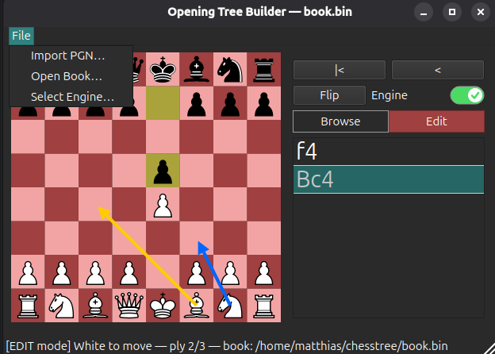

# Opening Tree Builder (OTB)




## What is it?

**OTB** stands for "**O**pening **T**ree **B**uilder". I know this acronym is occupied, it's a tribute to "Over The Board" chess &#128521;

OTB lets you build and save your opening repertoire in a single polyglot file.    
The polyglot format has many advantages over PGN: interchangeability with other tools like SCID, easy detection of transpositions, weigthing of branches and many more:  
https://chessprogramming.org/PolyGlot

OTB offers a $\color{#00FF00}{\text{browse-mode (green)}}$, where moves that you enter in the chessboard are **NOT** saved.   
In $\color{#FF0000}{\text{edit-mode (red)}}$ every move you enter is immediately saved to the polyglot file without additional user interaction.   
The default-filename name is book.bin, but you can create your own files.   
The currently used book and further status information is displayed in the bottom statusbar.

You can also expand your opening tree by importing PGN-files via <kbd>File</kbd> &rarr;   <kbd>Import PGN...</kbd> (e.g. PGN's that you exported from other tools).

Deletion is done via right-click on a move in edit-mode.   
CAUTION: all attached branches to follow behind that node will also be also deleted.

## How to Run OTB

For quick evaluation and distribution the python package is managed by `uv`:   
https://docs.astral.sh/uv/

Installers will follow soon for every OS...

### Download the project from github into a project-folder of your choice
* `otb.py` : the single-file python code 
* `pyproject.toml` : description of dependencies. Used by `uv` to create a virtual environment
* `uv.lock` : the currently used dependencies for reproducible builds

### Install `uv` (One-time setup)
- **macOS / Linux:** Run this in your terminal:
  ```
  curl -LsSf https://astral.sh/uv/install.sh | sh
  ```
- **Windows:** Run this in PowerShell:
  ```
  powershell -ExecutionPolicy ByPass -c "irm https://astral.sh/uv/install.ps1 | iex"
  ```

### Launch the Application
Open a terminal in the project folder and run:
```
uv run otb.py
```
- **Windows** :
  you can create a shortcut in explorer: Right-click within your project-folder and select <kbd>new</kbd> &rarr; <kbd>shortcut</kbd>. Then enter this to the location field (replace path):
  ```
  C:\Windows\System32\WindowsPowerShell\v1.0\powershell.exe -ExecutionPolicy Bypass -NoExit -Command "Set-Location 'C:\path\to\project'; uv run otb.py"
  ```

*(This automatically downloads Python if needed, creates a virtual environment, installs PyQt6 and python-chess, and launches the app.)*

### Use an Engine

If you want to use engine-evaluation, toggle the engine-switch.     
A blue arrow will indicate the engine's top choice.   
Download your preferred engine (e.g. from https://stockfishchess.org/).    
Then set the location of the engine's executable via <kbd>File</kbd> &rarr; <kbd>Select Engine...</kbd> (will be saved to settings).


## Features to wish for
* edit weight for each move via context menu and sort the list by that value
* when hitting a transposition, show the multiple paths how to get there
* you name it...
